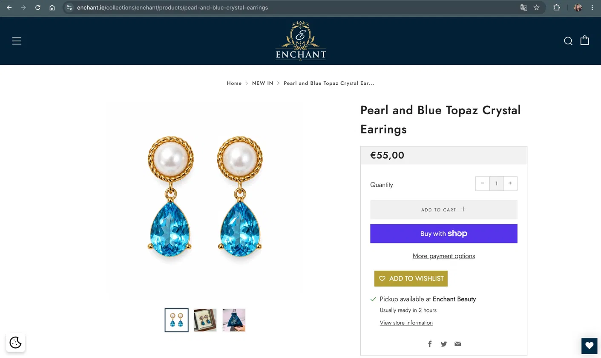
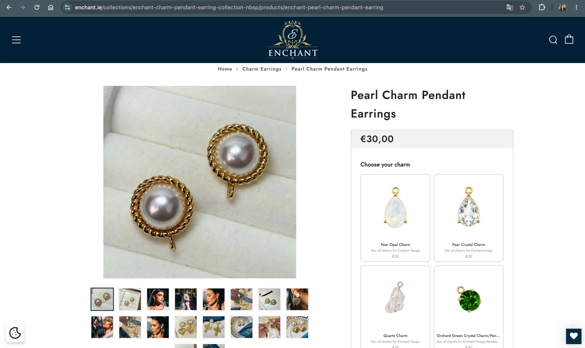

# Enchant Jewelry — Shopify Product Personalization

> Redesigning the product page experience to support charm customization — increasing conversion rate to **11% in 14 days**.

---

## Before & After

| Before | After |
|---|---|
|  |  |

---

## Overview

| | |
|---|---|
| **Client** | Enchant Jewelry — enchant.ie |
| **Location** | Ireland |
| **Platform** | Shopify |
| **Role** | UX Design + Shopify Development |
| **Type** | Solo project |

---

## The Problem

Enchant sells premium, customizable jewelry — but their Shopify product pages treated every item the same way.

Customers couldn't see or select interchangeable charms directly on the product page, leading to:

- Confusion about available options
- Support questions before purchase
- Missed upsell opportunities
- Purchase flow that didn't reflect the brand's premium positioning

---

## The Solution

Designed and implemented a **visual charm selector** directly on the product page — allowing customers to browse, compare, and choose their charm before adding to cart.

### What I built
- Custom Shopify section using **Liquid templating**
- Visual card-based selector with charm image + price per option
- Conditional rendering — only appears on customizable products
- Fully responsive — desktop and mobile
- Integrated naturally into the existing purchase flow as an upsell

---

## Results

| Metric | Result |
|---|---|
| **Conversion rate** | 11% |
| **Measurement window** | 14 days post-launch |
| **Average order value** | Increased via charm upsell |

---

## Tech Stack

- Shopify
- Liquid (Shopify templating language)
- HTML / CSS
- JavaScript (vanilla)
- Figma (UX design)

---

## Files in this repo

```
/
├── README.md
├── assets/
│   ├── before.png
│   └── after.png
└── snippets/
    └── charm-selector.liquid
```

---

## Live site

[enchant.ie](https://enchant.ie)

---

*Project by [Ascenda Web](https://ascendaweb.vercel.app)*
